# 🏆 SportConnect — Master Architecture & End-to-End Feature Workflow Guide

---

## 📑 Table of Contents
1. [Platform Overview & Tech Stack](#1-platform-overview--tech-stack)
2. [High-Level Design (HLD)](#2-high-level-design-hld)
   - [2.1 Overall System Architecture](#21-overall-system-architecture)
   - [2.2 Deployment & Network Topology (Docker SSR Networking)](#22-deployment--network-topology-docker-ssr-networking)
   - [2.3 Security & Authentication Architecture](#23-security--authentication-architecture)
3. [Low-Level Design (LLD)](#3-low-level-design-lld)
   - [3.1 Database Entity-Relationship (ER) Model](#31-database-entity-relationship-er-model)
   - [3.2 Frontend Architecture & Redux State Tree](#32-frontend-architecture--redux-state-tree)
   - [3.3 Backend Controller & Routing Design](#33-backend-controller--routing-design)
4. [End-to-End Feature Working Flows](#4-end-to-end-feature-working-flows)
   - [Flow 1: User Authentication & OAuth System](#flow-1-user-authentication--oauth-system)
   - [Flow 2: Athlete Scouting Profile & PDF Resume Generation](#flow-2-athlete-scouting-profile--pdf-resume-generation)
   - [Flow 3: Social Feed, Media Posts & Interaction Hub](#flow-3-social-feed-media-posts--interaction-hub)
   - [Flow 4: Athlete Networking & Connection Lifecycle](#flow-4-athlete-networking--connection-lifecycle)
   - [Flow 5: Squads & Teams Management Engine (with Live Chat)](#flow-5-squads--teams-management-engine-with-live-chat)
   - [Flow 6: Tournament Hub, Multi-Sport Scoring & Standings](#flow-6-tournament-hub-multi-sport-scoring--standings)
   - [Flow 7: Actionable Real-Time Notification Engine](#flow-7-actionable-real-time-notification-engine)
5. [Complete API Specification Summary](#5-complete-api-specification-summary)

---

## 1. Platform Overview & Tech Stack

**SportConnect** is a sports social platform and tournament management system built for athletes, squad captains, coaches, and event organizers.

### Technology Matrix

| Layer | Technology | Key Responsibility |
| :--- | :--- | :--- |
| **Frontend UI/UX** | **Next.js 15 (Pages Router)**, React 18 | SSR & CSR rendering, athlete scouting pages, responsive layouts |
| **State Management** | **Redux Toolkit** | Global authentication state, feed posts, user connection data |
| **Styling** | **Vanilla CSS Modules** | Custom dark navy sports design tokens, glassmorphism, responsive grid |
| **Backend API** | **Node.js, Express.js (ESM)** | REST API routing, business logic, file storage, security checks |
| **Database & ODM** | **MongoDB, Mongoose ODM** | Document database, complex population queries, schema indexing |
| **Auth & Security** | **Crypto (SHA-256 / 256-bit Hex)**, **Bcrypt.js** | Token session management, password hashing, OTP expiry TTL |
| **Document Generation**| **PDFKit** | Real-time athletic scouting resume PDF compilation & streaming |
| **Media Handling** | **Multer** | Multi-part form parsing, disk storage for profile pictures, posts, photos |
| **DevOps & Containers**| **Docker, Docker Compose** | Multi-container orchestration, internal bridge network routing |

---

## 2. High-Level Design (HLD)

### 2.1 Overall System Architecture

The following diagram illustrates the high-level tier breakdown across client browsers, Next.js frontend, Express API gateway, persistent storage, and third-party integrations:

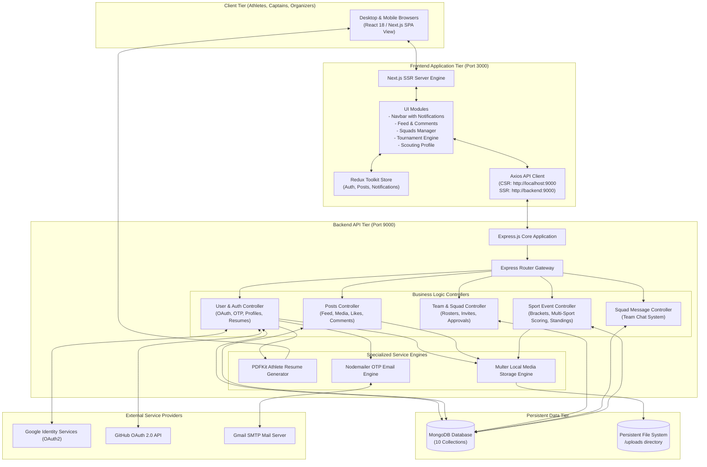

---

### 2.2 Deployment & Network Topology (Docker SSR Networking)

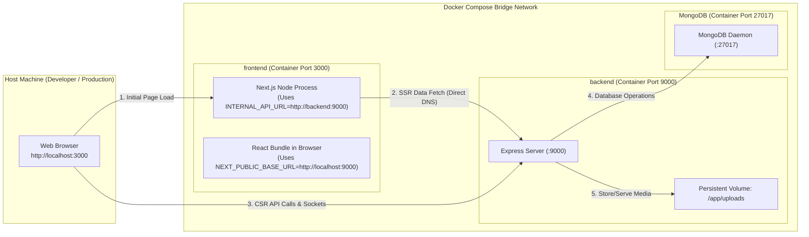

> [!NOTE]
> **Dual Networking Architecture:**
> 1. **Client-Side Requests (CSR):** Requests originate in user's browser, communicating via `http://localhost:9000`.
> 2. **Server-Side Rendering (SSR):** Requests originate inside the Next.js container during `getServerSideProps`, communicating via Docker DNS `http://backend:9000` via `serverClient`.

---

### 2.3 Security & Authentication Architecture

```mermaid
sequenceDiagram
    autonumber
    actor Athlete as Athlete / Client
    participant AuthCtrl as User Controller (Auth)
    participant OTPStore as MongoDB (OTP Collection)
    participant UserStore as MongoDB (User Collection)
    participant SMTP as Nodemailer / SMTP

    Note over Athlete, SMTP: Step A: 2-Factor Registration with Time-Bound OTP
    Athlete->>AuthCtrl: POST /auth/send-otp { email, type: 'registration' }
    AuthCtrl->>AuthCtrl: Generate 6-digit cryptographic OTP & hash with SHA-256
    AuthCtrl->>OTPStore: Save { email, otpHash, type, expires: 300s (TTL) }
    AuthCtrl->>SMTP: Send HTML Email with OTP
    SMTP-->>Athlete: Receive 6-digit OTP in inbox
    Athlete->>AuthCtrl: POST /auth/register { name, username, email, password, otp }
    AuthCtrl->>OTPStore: Find OTP doc by email & type; Compare SHA-256(otp)
    AuthCtrl->>UserStore: Create User with Bcrypt hashedPassword & 256-bit token
    AuthCtrl-->>Athlete: 200 OK + { token, user profile }

    Note over Athlete, SMTP: Step B: Stateful Token Validation
    Athlete->>AuthCtrl: Request with Header: x-auth-token or Body: { token }
    AuthCtrl->>UserStore: User.findOne({ token })
    UserStore-->>AuthCtrl: Valid User Document
    AuthCtrl-->>Athlete: Authorized Response
```

---

## 3. Low-Level Design (LLD)

### 3.1 Database Entity-Relationship (ER) Model

```mermaid
erDiagram
    USER ||--o| PROFILE : "has 1:1"
    USER ||--o{ POST : "creates"
    USER ||--o{ COMMENT : "writes"
    USER ||--o{ CONNECTION_REQUEST : "sends/receives"
    USER ||--o{ NOTIFICATION : "receives"
    USER ||--o{ TEAM : "creates as captain"
    USER }o--o{ TEAM : "joins as member"
    USER ||--o{ TEAM_MESSAGE : "posts in squad chat"
    USER ||--o{ SPORT_EVENT : "hosts"
    USER }o--o{ SPORT_EVENT : "follows"
    USER ||--o{ EVENT_PHOTO : "uploads"
    SPORT_EVENT ||--o{ EVENT_MATCH : "schedules"
    SPORT_EVENT ||--o{ EVENT_PHOTO : "contains"

    USER {
        ObjectId _id PK
        string name
        string username UK
        string email UK
        string password
        string provider "email | google | github"
        boolean active
        string profilePicture
        string token
        Date createdAt
    }

    PROFILE {
        ObjectId _id PK
        ObjectId userId FK
        string bio
        string currentPost
        Array pastWork "[company, position, years]"
        Array education "[school, degree, fieldOfStudy]"
    }

    POST {
        ObjectId _id PK
        ObjectId userId FK
        string body
        Array likes "string[] userIds"
        string media
        string fileType
        boolean active
        Date createdAt
        Date updatedAt
    }

    COMMENT {
        ObjectId _id PK
        ObjectId userId FK
        ObjectId postId FK
        string body
        Date createdAt
        Date updatedAt
    }

    CONNECTION_REQUEST {
        ObjectId _id PK
        ObjectId userId FK "Sender"
        ObjectId connectionId FK "Target Athlete"
        boolean status_accepted "null=pending | true=accepted | false=rejected"
    }

    NOTIFICATION {
        ObjectId _id PK
        ObjectId userId FK "Recipient"
        ObjectId senderId FK "Triggering User"
        string type "connection_request | comment | team_invite | team_join_request | like | team_message | event_invite"
        ObjectId relatedId "teamId | postId | eventId"
        string message
        boolean isRead
        Date createdAt
    }

    TEAM {
        ObjectId _id PK
        string name UK
        string sport
        string description
        ObjectId creatorId FK "Captain"
        Array members "ObjectId[] User FKs"
        number maxSize
        Date createdAt
    }

    TEAM_MESSAGE {
        ObjectId _id PK
        ObjectId teamId FK
        ObjectId senderId FK
        string message
        Date createdAt
    }

    SPORT_EVENT {
        ObjectId _id PK
        string name
        string description
        ObjectId hostId FK
        Date startDate
        Date endDate
        string eventKey UK "8-char uppercase"
        string coverImage
        Array followers "ObjectId[] User FKs"
        Array sports "[sportName, advanceCount, teams, standings]"
        Date createdAt
    }

    EVENT_MATCH {
        ObjectId _id PK
        ObjectId eventId FK
        string sport
        Object homeTeam "{name, color}"
        Object awayTeam "{name, color}"
        number homeScore
        number awayScore
        string period "1st Half | Q1 | 2nd Innings etc."
        Mixed scoreDetails "Quarter, Sets, Wickets breakdown"
        string status "scheduled | live | completed"
        string round "Group Stage | Semis | Finals"
        Date matchDate
        string venue
        string winner
    }

    EVENT_PHOTO {
        ObjectId _id PK
        ObjectId eventId FK
        ObjectId hostId FK
        string caption
        string media
        string fileType
        Array likes "string[] userIds"
        Date createdAt
    }

    OTP {
        ObjectId _id PK
        string email
        string otpHash
        string type "registration | password_reset"
        number attempts
        Date createdAt "TTL 300s"
    }
```

---

### 3.2 Frontend Architecture & Redux State Tree

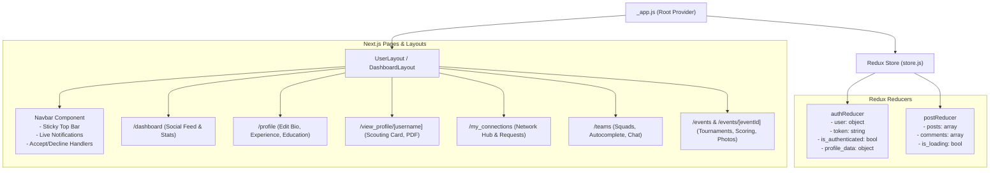

---

### 3.3 Backend Controller & Routing Design

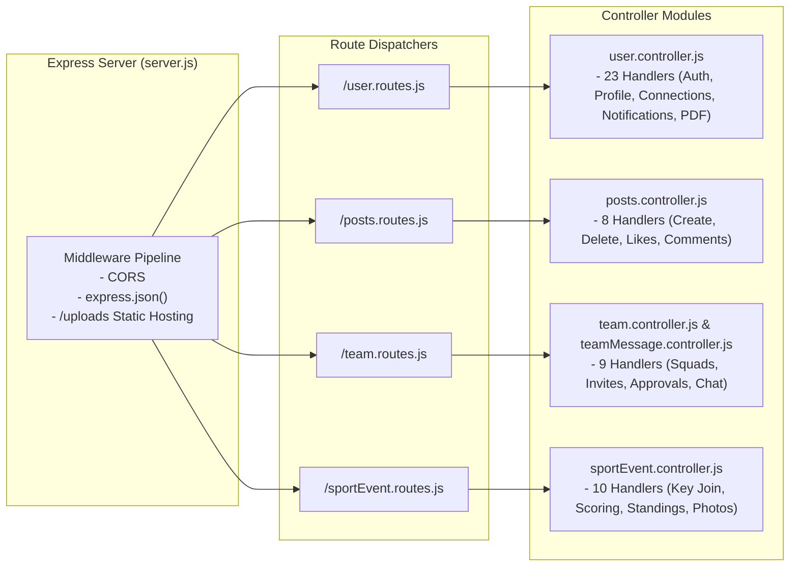

---

## 4. End-to-End Feature Working Flows

### Flow 1: User Authentication & OAuth System

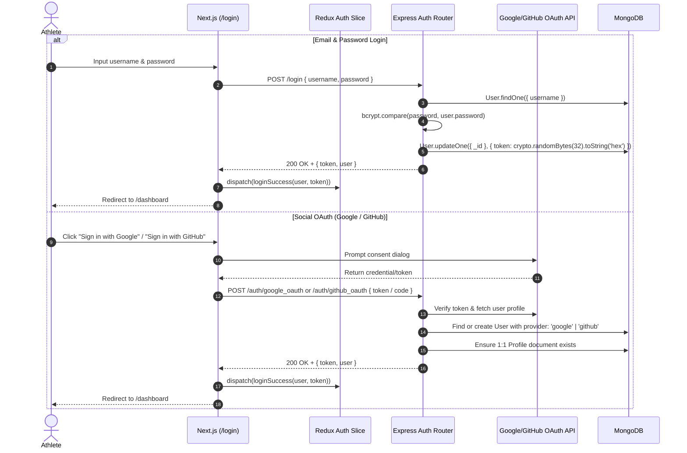

---

### Flow 2: Athlete Scouting Profile & PDF Resume Generation

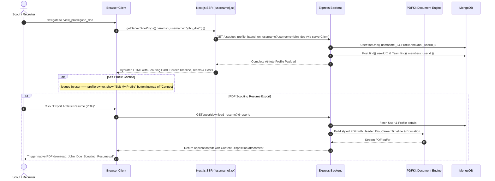

---

### Flow 3: Social Feed, Media Posts & Interaction Hub

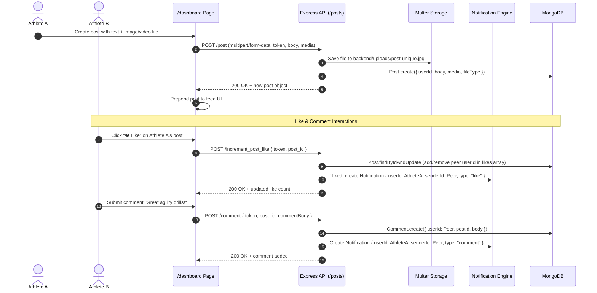

---

### Flow 4: Athlete Networking & Connection Lifecycle

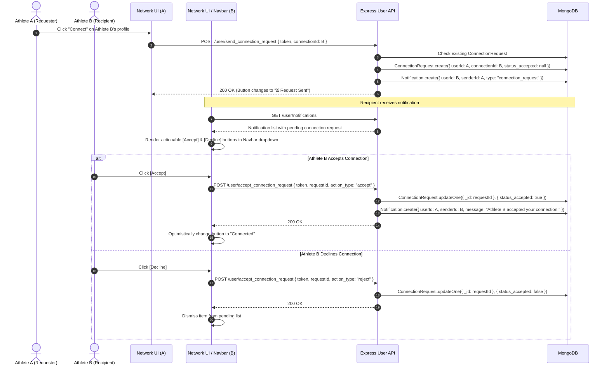

---

### Flow 5: Squads & Teams Management Engine (with Live Chat)

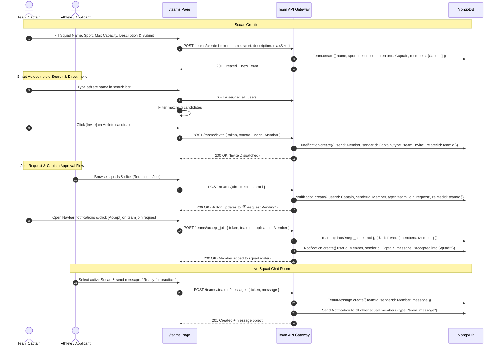

---

### Flow 6: Tournament Hub, Multi-Sport Scoring & Standings

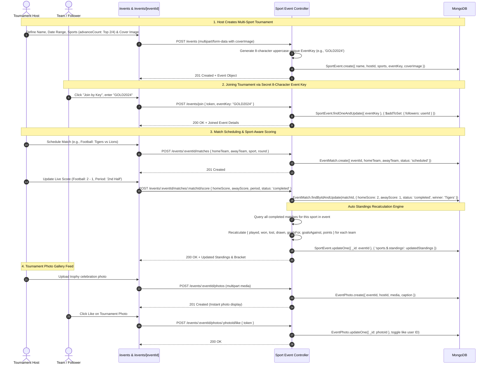

---

### Flow 7: Actionable Real-Time Notification Engine

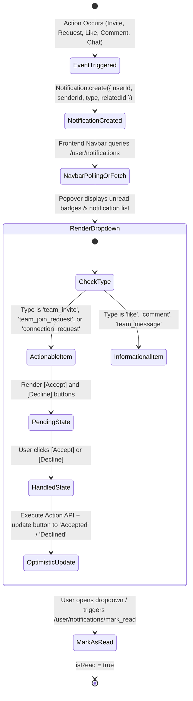

---

## 5. Complete API Specification Summary

### 🔐 Authentication & Profile (`/user.routes.js`)
- `POST /auth/send-otp` — Generate and email 5-minute cryptographic OTP.
- `POST /auth/register` — Verify OTP & create athlete account with hashed credentials.
- `POST /auth/login` — Authenticate and issue 256-bit crypto session token.
- `POST /auth/reset-password` — Verify password reset OTP and update password.
- `POST /auth/google_oauth` & `POST /auth/github_oauth` — OAuth token exchange and athlete profile synchronization.
- `GET /get_user_and_profile` — Fetch user account + 1:1 sports profile.
- `POST /update_profile_data` — Update bio, past sports clubs, and education timeline.
- `POST /update_profile_picture` — Multipart avatar upload via Multer.
- `GET /user/get_profile_based_on_username` — Public profile resolver with populate for scouting view.
- `GET /user/download_resume` — Stream generated PDFKit athlete resume.

### 🌐 Networking & Notifications (`/user.routes.js`)
- `POST /user/send_connection_request` — Send athlete connection invitation.
- `POST /user/accept_connection_request` — Accept or decline pending connection request.
- `GET /user/getConnectionRequests` — List pending incoming connection requests.
- `GET /user/user_connection_requests` — List user's active connection roster.
- `GET /user/notifications` — Fetch user's notification list.
- `POST /user/notifications/mark_read` — Mark notifications as read.
- `GET /user/trending_athletes` — Fetch top active athletes with highest connection counts.
- `GET /user/stats` — Fetch count of connections, posts, and teams for dashboard metrics.

### 📱 Social Feed & Comments (`/posts.routes.js`)
- `POST /post` — Create new post with optional image/video media.
- `GET /posts` — Fetch global chronologically ordered social feed with user profiles populated.
- `POST /delete_post` — Delete post created by user.
- `POST /increment_post_like` — Toggle like status on post & trigger notification.
- `POST /comment` — Add comment to post & trigger notification to post owner.
- `GET /get_comments` — Fetch comments for a specific post.
- `DELETE /delete_comment` — Remove comment by author.

### 👥 Squads & Teams (`/team.routes.js`)
- `GET /teams` — List all sports teams with members and captain details.
- `POST /teams/create` — Create a new squad with sport tag and maximum roster size.
- `POST /teams/join` — Submit join request to squad captain.
- `POST /teams/accept_join` — Squad captain approval of incoming athlete request.
- `POST /teams/reject_join` — Squad captain rejection of athlete request.
- `POST /teams/invite` — Captain sends direct invite to an athlete.
- `POST /teams/accept_invite` — Athlete accepts squad invitation.
- `POST /teams/leave` — Athlete leaves a squad.
- `GET /teams/user/:userId` — Fetch all squads a specific athlete belongs to.
- `GET /teams/:teamId/messages` — Fetch chat message history for a squad.
- `POST /teams/:teamId/messages` — Send squad message & notify all squad members.

### 🏆 Tournaments & Sports Events (`/sportEvent.routes.js`)
- `GET /events` — List all sports events and tournaments.
- `POST /events` — Create event with sports categories, advancement count, and cover image.
- `POST /events/join` — Join tournament as follower using unique 8-character Event Key.
- `GET /events/:eventId` — Retrieve tournament details, teams, sports, and followers.
- `POST /events/:eventId/teams` — Add team to a sport category in the tournament.
- `GET /events/:eventId/matches` — Fetch all scheduled/live/completed matches for an event.
- `POST /events/:eventId/matches` — Host schedules a match between two teams.
- `POST /events/:eventId/matches/:matchId/score` — Update live match score & auto-recalculate standings.
- `GET /events/:eventId/photos` — Fetch tournament photo feed.
- `POST /events/:eventId/photos` — Upload tournament photo with caption.
- `POST /events/:eventId/photos/:photoId/like` — Toggle like on tournament photo.
